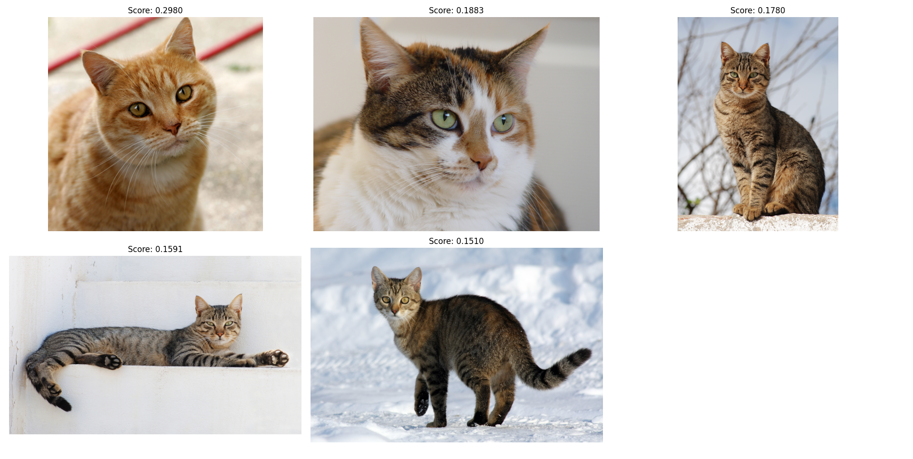

# Image Semantic Search

A Python application that uses OpenCLIP (Contrastive Language-Image Pre-training) for semantic search of images based on natural language queries.

## Overview

This project demonstrates how to:

- Download and store images from the web
- Generate vector embeddings for images using OpenCLIP
- Search for images using natural language queries
- Display search results with similarity scores

## Features

- **Text-to-Image Matching**: Find images that match natural language descriptions
- **Image-to-Image Matching**: Find similar images to a reference image
- **Customizable Search**: Control the number of results and similarity threshold
- **Visualization**: Display search results with similarity scores

## Requirements

- Python 3.11+
- Dependencies listed in pyproject.toml:
  - langchain-experimental
  - loguru
  - matplotlib
  - open-clip-torch
  - pillow
  - scikit-learn
  - torch
  - tqdm

## Installation

1. Clone the repository:

   ```bash
   git clone https://github.com/vnniciusg/image-semantic-search.git
   cd image-semantic-search
   ```

2. Create a virtual environment (optional but recommended):

   ```bash
   uv venv
   source venv/bin/activate  # On Windows use `venv\Scripts\activate`
   ```

3. Install the required dependencies:

   ```bash
   uv sync
   ```

## Usage

Run the main script to start the application:

```bash
uv run main.py
```

## How It Works

1. **Image Downloading**: The application downloads images from a specified URL and stores them in a local directory.
2. **Vector Embedding Generation**: It uses OpenCLIP to generate vector embeddings for the downloaded images and stores them in a database.
3. **Semantic Search**: The application allows users to input a natural language query or an image file. It computes the similarity between the query and the stored image embeddings using cosine similarity.
4. **Results Display**: The top N most similar images are displayed along with their similarity scores.
5. **Image-to-Image Search**: Users can also search for similar images by providing a reference image.

## Example

- **Text Query**: "a orange cat"

The application will search for images that match this description and display the results. You can adjust the number of results and the similarity threshold in the code.

[](assets/example.png)

## License

This project is licensed under the MIT License. See the [LICENSE](LICENSE) file for details.

## References

- [Creating a Semantic Image Search with Vector Embeddings](https://medium.com/data-science-collective/creating-a-semantic-image-search-with-vector-embeddings-499578c51cb2)
